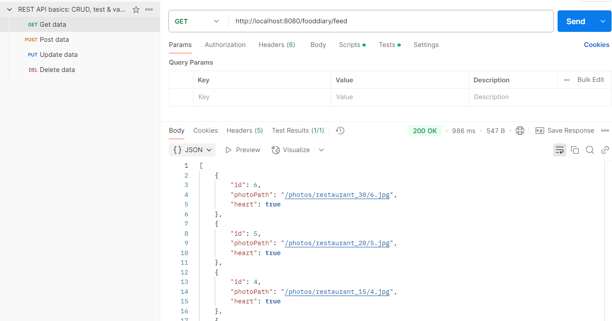
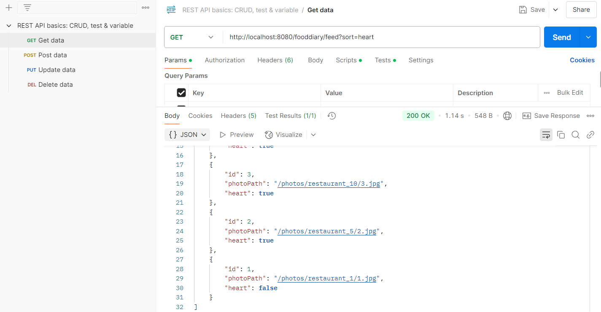
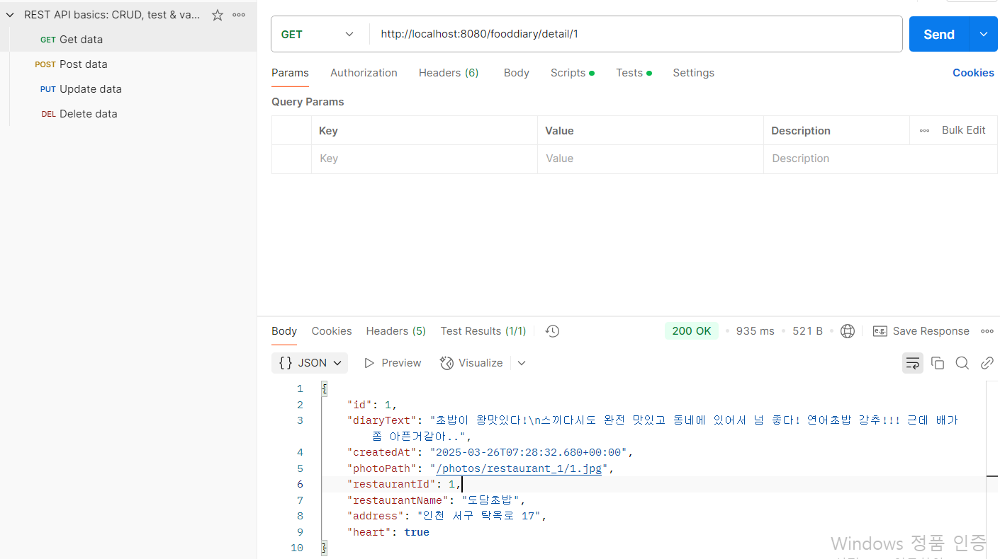

# 🍽️ 한입만 (HannipmanApp)

> 나만의 식당 다이어리 앱 ✨
> 지도에서 식당을 찾고, 맛집에서의 추억을 일기로 남겨보세요!

---

## 📌 프로젝트 개요

**한입만**은 사용자가 방문한 식당을 지도에서 확인하고, 그곳에서의 추억을 사진과 함께 기록할 수 있는 **맛집 다이어리 앱**입니다.

- 카카오 로그인으로 간편한 사용자 인증
- 지도 기반 UI로 식당 탐색
- 식당별로 일기 작성 + 이미지 업로드
- 하트(좋아요) 기능 연동으로 나만의 맛집 리스트 관리

---

## 🛠️ 사용 기술

| 분야 | 기술 |
|------|------|
| Language | Java 17 |
| Framework | Spring Boot |
| Database | MySQL, JPA, Hibernate |
| Cloud | AWS EC2, RDS |
| Tooling | IntelliJ, Postman, GitHub |
| Login API | Kakao Login |

---

## 📦 백엔드 작업

| 역할          | 상세 설명                                    |
|-------------|------------------------------------------|
| 💾 DB 설계    | 식당/일기 테이블 및 연관관계 설계 (JPA)                |
| 🧃 일기 API   | 생성, 수정, 삭제, 상세 조회, 자동 증가 초기화, 리스트 API 구현 |
| 📍 지도 연동    | 지도에서 클릭한 식당의 일기, 하트 연동 API 구현              |
| 📸 이미지 업로드  | Multipart 파일 저장 및 로컬 경로 관리               |
| ❤️ 하트 기능    | 식당 하트 토글 API, 일기/피드/상세 하트 연동 구현          |
| 🧭 피드 정렬 기능 |하트순 / 최신순 정렬 API 구현                |
| 🚀 EC2 배포   | EC2 서버에 jar 배포, RDS(MySQL) 연동 설정 완료      |

## 📱 프론트엔드 작업

| 역할 | 상세 설명 |
|------|-----------|
| 🔑 카카오 로그인 | 카카오 로그인 버튼 UI, 사용자 인증 처리 |
| 🙋 마이페이지 구현 | 사용자 프로필(닉네임, 이미지 등) 마이페이지에 표시 |


---


## 🔧 기능 상세 (Back-End)

### 📍 지도 기반 식당 조회 ([peh1212](https://github.com/peh1212/FoodDiaryApp) 개발)
- Google Maps API를 통해 현 위치 기반 지도 표시
- 마커 클릭 시 해당 식당의 정보 표시

### ✨ 지도-일기 & 하트 연동 로직 구현
- 지도에서 클릭한 식당의 일기 목록 조회 (BottomSheet 스타일)
- 지도, 일기, 하트 간 데이터 연동 구조 설계 및 로직 개발

### 📝 식탁 일기 기능
- `POST /fooddiary`: 일기 생성 (음식 이미지 포함)
- `GET /fooddiary/{restaurantId}`: 해당 식당의 일기 리스트 조회
- `GET /fooddiary/detail/{diaryId}`: 일기 상세 조회 (식당 정보 포함)
- `PUT /fooddiary/{diaryId}`: 일기 수정
- `DELETE /fooddiary/{diaryId}`: 일기 삭제
- `DELETE /fooddiary/deleteAll`: 전체 일기 삭제
- `DELETE /fooddiary/resetAutoIncrement`: ID 초기화

### 🖼️ 이미지 업로드
- Multipart 형식으로 이미지 파일 업로드
- 이미지 파일은 서버 로컬 디렉토리 `/photos/`에 저장
- `photoPath`는 앱에서 Glide로 호출 가능하도록 URL 경로 제공

### ❤️ 좋아요(하트) 기능 (식당 단위)
- `PATCH /restaurants/{restaurantId}/heart` → 하트 토글
- 일기 리스트 / 상세 / 피드에서 `heart` 상태 반영

### 📰 전체 피드 기능
- `GET /fooddiary/feed` : 전체 일기 사진 리스트 조회
- `?sort=latest` : 최신순 정렬 (기본값)
- `?sort=heart` : 하트순 정렬 (하트 누른 일기 먼저)
- 응답은 `photoPath`, `id`, `heart` 포함

### 👤 카카오 로그인 & 마이페이지 연동
- 카카오 API를 통해 사용자 인증 처리
- 로그인 후 사용자 프로필(닉네임, 이미지 등) 불러오기
- 마이페이지에서 사용자 정보 확인 가능

### 🧠 데이터 연동 구조
- `FoodDiary` ↔ `Restaurant` : ManyToOne 연관관계
- 일기 생성 시 특정 식당 ID를 함께 저장
- 하트는 Restaurant의 필드로 관리하며, 전체 피드 및 일기 조회 시 연동

---
## 📌 API 사용 예시 (Postman 결과)

### ✅ 전체 피드 조회 (최신순)


### ✅ 하트순 정렬 조회


### ✅ 일기 상세 조회


---

## 🔑 핵심 API 코드 예시

### 🔐 카카오 로그인 API
```java
@PostMapping("/login/kakao")
public ResponseEntity<UserDTO> kakaoLogin(@RequestBody KakaoLoginRequest request) {
    User user = userService.loginWithKakao(request.getAccessToken());
    return ResponseEntity.ok(new UserDTO(user.getNickname(), user.getProfileImage()));
}
```

### 📖 식당 ↔ 일기 연동 API
```java
@PostMapping("/fooddiary")
public ResponseEntity<?> createDiary(@RequestParam Long restaurantId,
                                     @RequestParam String diaryText,
                                     @RequestParam(required = false) MultipartFile photo) {
    foodDiaryService.saveDiary(restaurantId, diaryText, photo);
    return ResponseEntity.ok("일기가 성공적으로 추가되었습니다.");
}
```

### 📸 이미지 URL 반환 로직
```java
private String savePhoto(byte[] photoBytes, Long restaurantId, Long diaryId) throws IOException {
    String photoPath = "/photos/restaurant_" + restaurantId + "/" + diaryId + ".jpg";
    File file = new File("photos" + photoPath);
    if (!file.getParentFile().exists()) file.getParentFile().mkdirs();
    try (FileOutputStream fos = new FileOutputStream(file)) {
        fos.write(photoBytes);
    }
    return photoPath;
}
```

### ❤️ 하트 연동 API
```java
@GetMapping("/fooddiary/feed")
public ResponseEntity<List<FoodDiaryFeedResponse>> getFeed(@RequestParam(defaultValue = "latest") String sort) {
    List<FoodDiary> diaries = foodDiaryService.getAllDiariesSorted(sort);
    List<FoodDiaryFeedResponse> response = diaries.stream()
            .map(d -> new FoodDiaryFeedResponse(d.getId(), d.getPhotoPath(), d.getRestaurant().getHeart()))
            .collect(Collectors.toList());
    return ResponseEntity.ok(response);
}
```


## 🎯 향후 발전 방향 (개인 목표)

- [ ] 일기 단위 좋아요(하트) 기능으로 구조 개선하기
- [ ] 이미지 저장 방식 AWS S3로 전환
- [ ] 마이페이지에서 내가 하트 누른 일기만 필터링
- [ ] 식당 상세 페이지에서 유저 리뷰(댓글) 기능 추가
- [ ] 사용자 DB 구축하여 여러 유저가 함께 사용하는 앱으로 확장

---

## 💬 회고

> 팀 프로젝트에서 맡은 백엔드 파트를 책임지고 구현하면서,  
> REST API 설계, 파일 업로드, EC2 배포 등 실무에 가까운 경험을 할 수 있었습니다.  
> 특히, 정렬 조건 처리(`sort=heart`)와 하트 연동 설계는 기억에 남는 구현 경험이었습니다.

함께한 팀원들과의 협업을 통해 기술적 성장뿐 아니라 소통의 중요성도 배웠습니다. 🙌

